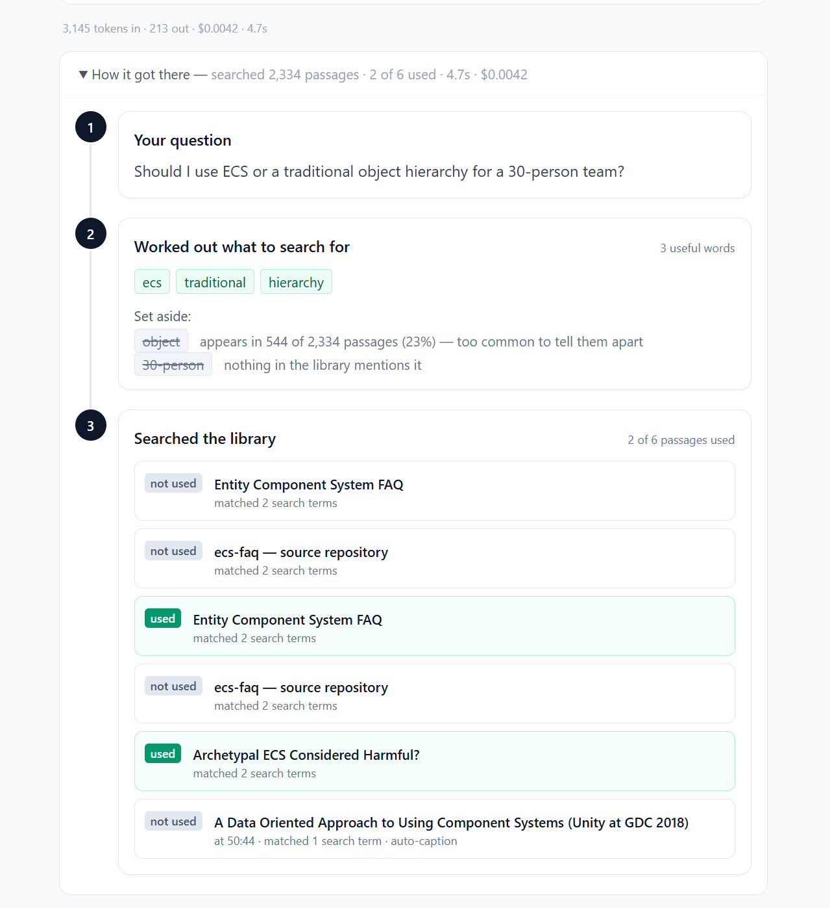
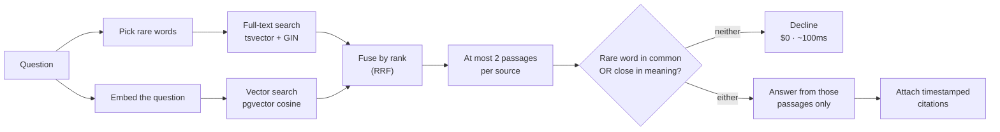

# Compendium

Ask a game development question. Get an answer built only from real conference
talks, open books and engineering write-ups — where **every claim is a link to the
exact second of the talk it came from**, and where the system says *"I don't know"*
rather than guessing.

Point it at your own material too: the talks you attended, the articles you saved,
your team's internal writing. Your sources stay yours.



---

## What it does differently

**It cites a timestamp, not a document.** A citation lands on
`youtube.com/watch?v=…&t=1450` — the second the speaker said it. You can check any
claim in about four seconds. Traffic goes *to* the source; the system never
substitutes for it.

**It keeps disagreement intact.** Ask whether to use ECS or a deep object
hierarchy and you get the ECS FAQ, a talk arguing for data-oriented design, and a
post arguing the benchmark wins are conditional — separately, each attributed.
Averaging shipped engineers' opposing experience into one confident paragraph is
the failure mode this is built against.

**It refuses.** When the library does not cover a question, the system declines
instead of improvising. Two independent tests have to fail first: no rare word in
common with the corpus, *and* no passage semantically close to it. The floor is
measured rather than guessed — the nearest miss this corpus can produce, indie game
pricing, scores 0.382 against a floor of 0.45, while in-domain questions sit at
0.53–0.63.

**It reads your material, not just ours.** Sources you add are yours alone: your
own corpus, searched alongside the shared library, invisible to everybody else.

**The two example questions are answered from a saved run.** Clicking them costs
nothing, returns in ~15 ms instead of ~8 s, and shows every visitor the same thing
so a report about it can be reproduced. Each recording is the exact payload the live
system produced — the passages it rejected included — and it is labelled *saved run*
on screen and `cached: true` in the API. Edit one character of the question and it
runs live. A system whose argument is "you can see what actually happened" does not
get to replay a recording while implying otherwise.

<sub>(It can also show its work — the words it searched for, the ones it discarded
and why, every passage it found and which the answer used, and the cost. That panel
sits under the answer and collapses if you would rather just have the answer.)</sub>

## The library

| | |
|---|---|
| Sources | **201** |
| Passages | **3,364** |
| Indexed text | **1,285,773 tokens**, all embedded |
| Cost per answered question | **~$0.0044** |
| Cost per refused question | **$0.00** — nothing is sent |
| Tests | 77, green in CI |

## What may be ingested, and what may not

Curation is the product, so the rules are part of it. Every source in the shared
library is hand-picked and legally indexable: talks the organiser published free,
books the author put online, open engineering writing, vendor documentation. The
manifest is [corpus/sources.json](corpus/sources.json) — the curation decisions are
in version control; the corpus text is not.

**Never ingested:** GDC Vault, paid postmortems, subscriber-only writing, published
books, anything behind a login or paywall, and any platform whose terms forbid
automated collection. Three GDC Vault URLs sit in the manifest and are refused by
name on every run, so the rule is visible rather than assumed.

**A refusal is an answer.** Three of these were live decisions, not hypotheticals:

- `gamedev.net` returned **403** to an automated request for an article that was
  wanted. It was dropped, not retried with a different user agent.
- `gamedeveloper.com`'s *GPU Performance for Game Artists* was wanted for the
  3D-asset corpus and rejected: its `robots.txt` disallows `ClaudeBot`, `GPTBot`
  and `CCBot` with `Disallow: /`. This agent is not named there, but the intent is.
- Two Valve wiki pages had been stored as 308 tokens of *"Making sure you're not a
  bot!"* — a challenge served with HTTP 200, so the status code could not see it.
  Detected and refused at fetch time now.

Answers are written in the system's own words and then cited, never more than a
short quote from any source. Traffic goes to the original; the system is not a
substitute for it. If you are a rights holder and want your work handled
differently, say so and it will be — removal, or link-only, no justification needed.

**Your own material is governed differently**, and the line is *who does the
fetching*. If this server requests a URL, it is the crawler and every rule above
applies. If you supply text you already hold — your notes, your transcript of a talk
you attended, a document your employer owns — that is your material and your call;
the obligations here are custodial: keep it private, keep it yours, delete it on
request.

## Your own sources

The shared library is a starting point, not the product. Each user has a private
corpus alongside it — the talks they attended, the articles they saved, their
team's internal writing — searched together with the shared library and visible to
nobody else.

```bash
python scripts/ingest.py --manifest corpus/test1_sources.json --owner test1
curl -s localhost:8000/ask -H 'content-type: application/json' \
  -d '{"question":"Should I use ECS or a traditional object hierarchy?","user":"test1"}'
```

[corpus/test1_sources.json](corpus/test1_sources.json) is a worked example: a
developer who went to a couple of conferences and keeps a reading list. It is
deliberately *not* one-sided — it holds the ECS FAQ and Acton's data-oriented
talks next to two posts arguing the case is overstated, because a corpus where
everything agrees can demonstrate nothing about handling disagreement.

What that changes in practice, on the same question:

| | shared library only | with `test1`'s own sources |
|---|---|---|
| Passages searched | 2,994 | 3,130 |
| Top result | the ECS FAQ | the ECS FAQ, then a post arguing against it |
| Positions represented | one | two, cited separately |

Ownership is row-level: the natural key on `sources` is `(owner, url)`, not `url`,
so two users can save the same article without overwriting each other. Document
frequency is measured over the chunks a request can actually see — a term that is
rare in the shared library but everywhere in your own notes must not be treated as
rare *for you*. The reasoning is in
[migrations/0003_multi_tenant.sql](migrations/0003_multi_tenant.sql).

## How a question is answered



**Picking the rare words is where most of the judgment lives.** The system counts
how many of the 2,994 shared passages contain each word. `game` appears in 935 of
them (31%) — it cannot tell one passage from another, so it is set aside.
`30-person` appears in zero: not in the library at all, so it is set aside too, for
the opposite reason. `ecs` appears in 38, and that is what makes it evidence. The UI
explains both discard cases in a sentence, because they look identical to a reader
and mean opposite things.

**Searching by meaning covers what words cannot.** "How do I optimize performance
from externally imported 3D model assets?" contains none of the words its answer is
written in — *draw calls*, *LOD*, *mesh simplification* — so full-text search found
nothing useful while vector search put the right sources first. The reverse also
happens, which is why both run: an exact term like `ECS`, an API name or a version
number is precisely what an embedding blurs away. A passage found by *both* is
labelled as such in the UI, because agreement between two unrelated methods is the
strongest signal available.

**Declining is cheap and deliberate.** Both tests must fail, and the decision happens
before any model call — so a refusal costs nothing and returns in about 100 ms.

## Run it

Requires Python 3.12+ and Docker.

```bash
python -m venv .venv && source .venv/bin/activate
pip install -e ".[dev]"
cp .env.example .env                 # add an Anthropic API key

docker compose up -d                 # Postgres 17 + pgvector
python migrations/run.py             # apply schema
python scripts/ingest.py             # build the library (~10 min, no API key needed)

python -m compendium                 # http://127.0.0.1:8000
```

Open `http://127.0.0.1:8000` for the UI, or ask over HTTP:

```bash
curl -s localhost:8000/ask -H 'content-type: application/json' \
  -d '{"question":"How does an entity component system improve cache locality?"}' | jq
```

| Endpoint | Purpose |
|---|---|
| `GET /` | the one-page UI |
| `POST /ask` | question in, answer + citations + full retrieval trace out |
| `GET /corpus` | what the library contains, and which questions are pre-recorded |
| `GET /metrics/cost` | today's spend, p50/p95 latency |
| `GET /livez` `/readyz` | liveness (no DB) and readiness (checks DB) |

```bash
pytest -q                            # 40 tests
ruff check . && ruff format --check .
```

## Decisions worth defending

**Two retrievers, fused by rank rather than by score.** Full-text search and vector
similarity both run, and each passage is scored `sum(1 / (60 + rank))` over the
retrievers that returned it. Fusing *ranks* is the deliberate part: `ts_rank_cd` and
cosine similarity are different units on different scales, and normalising one onto
the other would manufacture a comparison that does not exist. Rank is the only thing
both retrievers agree on the meaning of.

Why both are needed, concretely. "How do I optimize performance from externally
imported 3D model assets?" contains none of the words its answer is written in —
*draw calls*, *LOD*, *mesh simplification* — so full-text search returned nothing
useful while vector search put the three right sources in the top three. The reverse
also happens: an exact term like `ECS`, an API name or a version number is precisely
what embeddings blur away. With no OpenAI key, no embeddings, or a failed embedding
call, this degrades to exactly the lexical search it was before.

**Still no vector index.** 3,364 vectors are scanned exactly on every query, which
at this size is not the bottleneck. An HNSW index buys nothing measurable here, and
adding one before a query is observably slow would be cargo cult.

**Ranking is one number, not a sort key hierarchy.** An earlier version ordered by
`matched_terms DESC, density DESC`, which is lexicographic: *any* two-term match beat
*every* one-term match. On the ECS question that put a density-0.30 passage above a
density-0.70 one, and the model then cited [3][4][5] while [1][2] sat on top — the
displayed order contradicting the model's own judgement, which is worse than a bad
order because it makes the trace look dishonest. `density * matched_terms` keeps both
signals live in one monotone number that can be explained in a sentence.

**At most two passages from any one source.** Without a cap, one long talk filled
five of eight results and the answer looked like a single-source opinion. A per-source
cap is the cheapest diversity control there is, and it is what makes a two-sided
answer possible at all.

**Duplicate sources are detected by shingle sketch, not by content hash.** The same
document lives at more than one URL — a docs site and the repository it is generated
from, `http://` and `https://` spellings of one page. Hashing the content finds
almost none of it: on a real pair, exact chunk hashes agreed on 3 of 16 chunks
(jaccard 0.100), because a rendered page and its Markdown source differ on nearly
every line and one byte changes a hash completely. Each source instead stores a
bounded fingerprint — the 128 smallest hashed 8-word shingles plus the true shingle
count — and duplicates are found by *containment*, "is this source already inside
that one", which Jaccard cannot express because it penalises a size difference.
Across all 35,532 ordered pairs, six scored above 0.35 and every one was a true
duplicate; nothing at all landed between 0.35 and 0.651. The threshold sits in that
empty band. Reasoning, and the point where this needs MinHash and LSH instead, is in
[dedupe.py](src/compendium/corpus/dedupe.py).

**A bot challenge is a failed fetch, not content.** Two Valve wiki pages had been
stored as 308 tokens of "Making sure you're not a bot!" — served with HTTP 200, so
the status code could not see it. Likewise a GitHub repo page is mostly GitHub's own
navigation and marketing; twenty-one sources were stored as ~90% identical
boilerplate, which is what the duplicate detector actually surfaced first. Both are
refused at fetch time now, and reported: nine repositories keep their README
somewhere the raw URL does not reach, and the ingest report names each one instead of
storing chrome that is retrievable, citable and meaningless.

**No agent framework.** No LangChain, LangGraph, LlamaIndex or DSPy, and no separate
vector database. Retrieval is SQL, the prompt is a string, and the single network
call to a model lives in one function. Every step is inspectable because there is no
layer hiding it — which is the entire premise of the UI.

**No build step.** The UI is one server-rendered HTML file with Tailwind from a CDN.
No Node, no bundler, no second deployable, no CORS. For a two-screen interface a
React app would have doubled the deployment surface to save nothing.

**Dataclasses inside, Pydantic at the edges.** Rows from Postgres were already
validated by CHECK constraints at write time; re-validating them on every read costs
per-row overhead on the retrieval path. Request bodies are validated by nobody until
they arrive, so those get Pydantic. The reasoning is in
[schema.py](src/compendium/schema.py).

**Chunking respects caption boundaries.** Transcript cues are grouped, never split,
and `end_ts` is clamped because YouTube captions overlap by 95–100%. Get this wrong
and every timestamp drifts — which makes every citation subtly wrong while looking
completely fine.

## Scope

This is a working system, not a product. Three limits are worth knowing before you
run it:

- **No authentication.** `user` scopes a query correctly and stops there — it is a
  tenancy key, not a credential. Fine for a local demo, not for anything else.
- **Adding sources is a CLI**, driven by a manifest. There is no upload path.
- **Article extraction is a regex**, so documentation sites that build their
  sidebars from plain `<div>`s carry some navigation text into the index.

## Layout

```
src/compendium/
  main.py         FastAPI app; /ask, /corpus, health, cost
  static/         the one-page UI
  retrieve.py     term selection, document frequency, full-text search
  answer.py       prompt, the single model call, refusal rule, citations
  corpus/         fetch → normalise → chunk → load pipeline
  schema.py       row shapes, and the reasoning behind them
  telemetry.py    tokens, latency, cost per call
migrations/       hand-written SQL, applied by migrations/run.py
tests/            77 tests, green in CI
evals/            golden question set, with measured results
corpus/           the manifest — which sources, and why each is permitted
```
